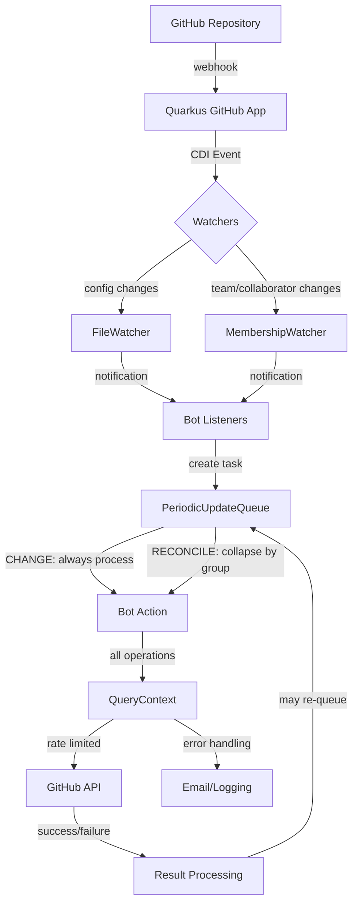

This section provides additional information that provides context and explains design and implementation choices.

Base file system directory for source: `bot-github-core/src/main/java`

There are four packages in the common bot module:

1. `org.commonhaus.automation.config` is the base bot config (shared by all bots) and common config types (POJO)
2. `org.commonhaus.automation.github` contains a few subpackages: 
    - `context`: utilities for parsing and retaining context across queries during a session
    - `discovery`: special installation/repository discovery event handling
    - `queue`: A queue mechanism that creates a rate-limited thread for processing events and updates. All CHANGE events are processed. RECONCILE events can be skipped/grouped if the taskGroup matches.
    - `watchers`: File and Team monitors that convert GitHub events (completely async and whenever) into notifications for bot-specific listeners (who then add appropriate CHANGE or RECONCILE events to the queue).
3. `org.commonhaus.automation.mail` provides common code for working with the Quarkus mail extension to send mail notifications using SMTP
4. `org.commonhaus.automation.markdown` provides a common markdown converter


**JsonAttribute Design Pattern**: The project uses two different JSON libraries with completely different object models:
- **Java GitHub SDK**: Jackson for REST API responses
- **Quarkus GitHub App**: JSON-P (Jakarta) for GraphQL responses

Rather than creating heavy POJOs for each library, `org.commonhaus.automation.github.JsonAttribute` provides a unified parsing approach that:

**Design Goals**:
- **Avoid POJO overhead**: POJOs for two different object models proved not worth the complexity
- **Readable parsing**: Methods read like sentences, especially for GraphQL response parsing
- **Forgiving POJOs**: Where POJOs exist, they tolerate null/missing values and only read what's needed
- **Query alignment**: Parsing maps directly onto GraphQL queries (defined nearby in code)

**JsonAttribute Benefits**:
- **(a) Avoid typos**: Common field names are enumeration values (`login`, `name`, `id`)
- **(b) Consistent parsing**: Same interface for attributes across different payload types
- **(c) Sentence-like interface**: 
    ```java
    JsonArray nodes = JsonAttribute.nodes.jsonArrayFrom(pageLabels)
    this.category = JsonAttribute.category.discussionCategoryFrom(object);
    ```

This approach provides straightforward parsing that easily maps onto GraphQL queries while avoiding the overhead of maintaining dual POJO hierarchies.

`org.commonhaus.automation.github.ContextService` (and `org.commonhaus.automation.github.BaseContextService`) provide common functions shared by all bots, like logging and sending email with common bot configuration.

**QueryContext Architecture** - The **most important** component that handles all GitHub API invocations with consistent error handling:

**Class Hierarchy**:
- `GraphQLQueryContext`: Base class for error accumulation and GraphQL operations
- `GitHubQueryContext`: Adds GitHub REST API support and installation-specific context
- `ScopedQueryContext`: Repository/organization-scoped operations with installation mapping

**Core Responsibilities**:
- **All GitHub API calls**: Every GitHub operation (REST/GraphQL) flows through QueryContext methods
- **Error accumulation**: Captures errors as close to occurrence as possible, allowing processing to continue
- **DryRun integration**: `isDryRun()` flag passed to all operations, preventing mutations during testing
- **Built-in retries**: Automatic retry for authentication errors (401/403) up to 2 attempts

**Error Handling Features**:
- **Granular error inspection**: Methods like `hasNotFound()`, `hasErrors()` for specific error type checking
- **Context-specific recovery**: Error recovery varies by situation; most cases log and stop, but some have clear fallbacks (e.g., bot comment not found by ID → search all comments to fix the link)
- **Error bundling**: `bundleExceptions()` packages all accumulated errors for final handling
- **Continuation capability**: Processing can continue after errors, with caller deciding appropriate response strategy

**Installation Scoping (`ScopedInstallationMap`)**:
- Maps GitHub organizations to specific app installation IDs
- **Multi-organization support**: Ensures each operation uses correct installation context
- **Permission isolation**: Prevents cross-organizational data access or permission leakage
- **Dynamic installation discovery**: Automatically tracks and maps available installations

**Usage Pattern**: Short-lived context objects created per operation that accumulate errors, handle authentication, manage installation scoping, and provide comprehensive error reporting to callers for intelligent retry/fail decisions.

`org.commonhaus.automation.queue.PeriodicUpdateQueue` functions as a rate-limiting queue that processes GitHub events and CDI tasks with controlled pacing:

**Task Processing Rules**:
- **CHANGE tasks**: Always processed (represent specific events that must be handled)
- **RECONCILE tasks**: Can be collapsed by `taskGroup` to avoid redundant expensive operations
  - If multiple RECONCILE tasks with the same `taskGroup` are queued, only the latest is processed
  - This allows changes to "quiesce" before triggering expensive summary/reactive processing

**Task Group Assignment** (programmatically defined by each bot):
- **HausRules**: Uses issue/discussion ID (e.g., vote counting for a specific discussion)
- **HausManager/HausKeeper**: Varies by operation but ensures appropriate uniqueness for collapsing
- Groups are assigned to ensure expensive operations can be collapsed as late as possible

**Purpose**: Rate limiting ensures sustained GitHub API usage without overwhelming the service, while task collapsing prevents redundant work when multiple rapid changes occur.

## Event Flow Through the System



**Key Flow Characteristics**:
- **Watchers** filter CDI events to bot-relevant notifications (FileWatcher for config changes, MembershipWatcher for team changes)
- **Queue** provides rate limiting and task collapsing (CHANGE tasks always process, RECONCILE tasks collapse by task group)
- **QueryContext** ensures all GitHub operations have consistent error handling, authentication retry, and dryRun support
- **Event-driven architecture** decouples GitHub's timing from bot processing pace while maintaining reliable multi-organization operation
