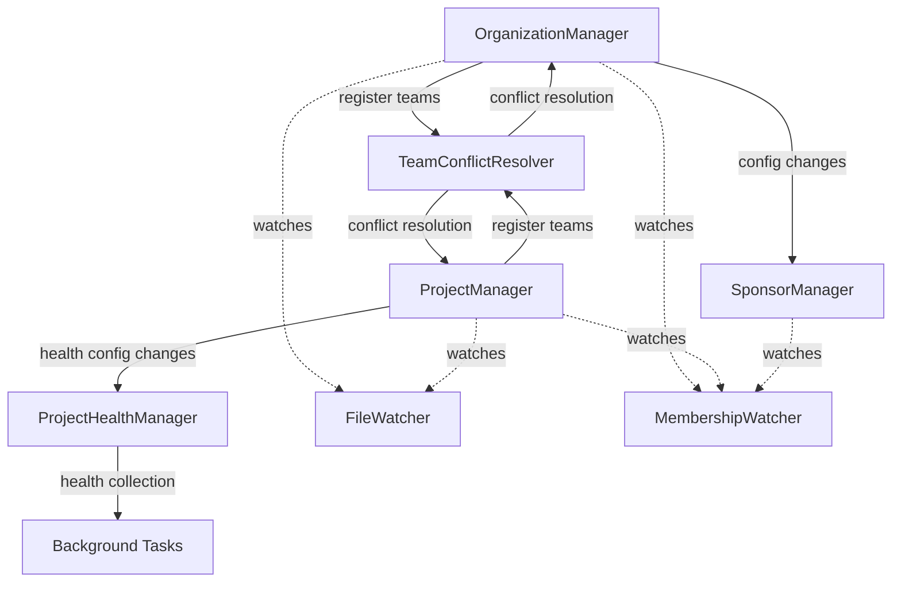

This section provides additional information that provides context and explains design and implementation choices.

Base file system directory for source: `haus-manager/src/main/java`

# Haus Manager: Organization/Team/Project Management

The Haus Manager provides comprehensive management of GitHub organizations, teams, collaborators, sponsors, and project health monitoring based on configuration files.

The Bot's configuration (ManagerBotConfig) defines a single primary organization and repository for organization-level configuration.

## Core Components

### OrganizationManager

**Single instance**: Manages organization-level team membership from the primary repository.

```yaml
teamMembership:
  dryRun: true
  source:
    repository: commonhaus/foundation
    filePath: CONTACTS.yaml
  defaults:
    field: login
    preserve_users:
      - commonhaus-bot
  sync:
    cf-council:
      teams:
        - commonhaus-test/cf-council
        - commonhaus-test/admin
```

- Configuration: `cf-haus-organization.yml` (`OrganizationConfig`, primary repository)
- Reads from configured `source` files (e.g., CONTACTS.yaml) to associate GitHub logins with groups
- Maps groups to GitHub teams across organizations via `sync` configuration
- **Priority**: Organization management takes precedence over project-level team management
- Notifies dependent components (SponsorManager) via callback system when config changes

### ProjectManager

**Single instance**: Manages project-specific team membership and collaborator access.

Looks for `project-*` repositories within the primary organization.

```yaml
collaboratorSync:
  sourceTeam: orgA/teamA
  role: write
  includeUsers: ["additional-user"]
  ignoreUsers: ["bot-user"]
teamMembership:
  - source:
      repository: commonhaus/foundation
      filePath: CONTACTS.yaml
    pushMembers:
      cf-council:
        teams: ["project-org/maintainers"]
projectHealth:
  organizationRepositories:
    "target-org":
      include: ["repo1", "repo2"]
      exclude: ["archived-repo"]
```

- Configuration: `cf-haus-manager.yml` (`ProjectConfig`, multiple repositories)
- **CollaboratorSync**: Synchronizes GitHub team members as repository collaborators
- **TeamMembership**: Maps source groups to project-specific teams
- **ProjectHealth**: Configures health metrics collection for specified repositories
- Registers with TeamConflictResolver to handle team ownership conflicts
- Notifies ProjectHealthManager when health collection settings change

### SponsorManager

**Single instance**: Manages sponsor access to repositories based on GitHub Sponsors and OpenCollective.

```yaml
sponsors:
  sponsorable: "organization-or-user"
  targetRepository: "org/repo"
  role: "triage"
  ignoreUsers: ["non-sponsor-user"]
```

- Aggregates sponsors from GitHub Sponsors API and OpenCollective
- Automatically grants repository access to active sponsors
- Listens to OrganizationManager config changes via callback registration
- Operates independently of team conflict resolution

### ProjectHealthManager

**Single instance**: Collects and stores project health metrics.

- Implements `ProjectConfigListener` to respond to project configuration changes
- Collects weekly health metrics (issues, PRs, stars, releases) for configured repositories
- Uses BACKGROUND task queuing for non-critical health collection work
- Supports both current metrics and full historical analysis
- Integrates with `ProjectHealthCollector` from bot-github-core stats package

### TeamConflictResolver

**Critical conflict management**: Prevents team management conflicts between organization and project levels.

- **Ownership Priority**: Organization > Single Project > Multiple Projects (conflict)
- **State Persistence**: Maintains conflict state across application restarts
- **Conflict Types**:
  - `ORGANIZATION`: Org-level config takes precedence
  - `PROJECT`: Single project manages team
  - `PROJECT_CONFLICT`: Multiple projects claim same team (blocked)
  - `EMPTY`: No active management
- **Email Notifications**: Alerts administrators about conflicts with resolution guidance
- **Automatic Cleanup**: Removes stale entries after bootstrap discovery

## Discovery and Lifecycle

**Repository Discovery**: Uses priority-based discovery events (`RdePriority.APP_DISCOVERY`) to:
- OrganizationManager: Watches for main repository containing `cf-haus-organization.yml`
- ProjectManager: Discovers any repository in primary org with `cf-haus-manager.yml`
- Both register FileWatcher and MembershipWatcher during discovery

**Bootstrap vs Runtime**: Different behavior during initial discovery vs live updates:
- Bootstrap: Defers reconciliation until all repositories discovered
- Runtime: Immediate reconciliation on config changes

## Component Relationships



## Key Design Patterns

**Callback/Listener Pattern**: Components register for notifications (OrganizationManager → SponsorManager, ProjectManager → ProjectHealthManager)

**Conflict Resolution**: TeamConflictResolver ensures single ownership of teams with organization-level priority

**Task Queue Integration**: Uses PeriodicUpdateQueue for rate-limited operations and BACKGROUND tasks for health collection

**Task Group Strategy**: Each manager uses specific task group naming for fine-grained queue management and conflict resolution:
- OrganizationManager: `"🏡-org"` (single group)
- ProjectManager: `"cfg#" + repoFullName` (per-repository groups)
- SponsorManager: `"💸-sponsor"` (single group)
- ProjectHealthManager: `"health#" + repoFullName` (per-repository groups)
- TeamConflictResolver: Uses project task groups for updates

**Watcher Integration**: All managers use FileWatcher and MembershipWatcher for responsive configuration and membership changes

**State Persistence**: Critical state (team conflicts) persisted to disk for reliability across restarts

**Error Handling**: All managers use consistent error handling:
- Configuration parsing errors → Email notifications to configured addresses
- GitHub API errors → Context accumulation with retry logic
- Team conflicts → Email notifications with resolution guidance
- Health collection errors → Logged but don't block other operations

**Scheduled Operations**:
- OrganizationManager: Every 3 days at 2:47 AM (`0 47 2 */3 * ?`)
- ProjectManager: Every 3 days at 4:47 AM (`0 47 4 */3 * ?`)
- SponsorManager: Every 3 days at 1:47 AM (`0 47 1 */3 * ?`)
- ProjectHealthManager: Weekly on Sunday at 6:00 AM (`0 0 6 ? * SUN`)
  