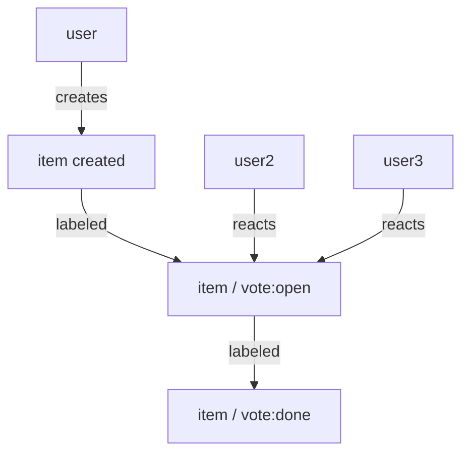

# Commonhaus Foundation Automation tools

## GitHub App

The CF follows an adapted form of 

labels:
- `vote:open` - a sense vote
- `vote:done`  - voting is closed

elements:
- Item: PR or Discussion

Diagrams escape me. The idea is that a user creates an item.

Either they apply the `vote:open` label, or they use a bot command to assign the label and open the vote.

While the vote is open, the bot will count reactions to the item itself (not its comments). It will update a section of the desription with the current vote tally, including whether or not quorum has been reached.

When the vote is closed, the bot will apply the `vote:done` label and close the vote (no more reactions will be counted).

- The group that should be used to determine quorum must be specified in the item (or a default group can be specified in the bot config). `::quorum @groupname` would work, and would tag required participants as well.

## Related Guides

- Quarkiverse [GitHub App extension guide](https://quarkiverse.github.io/quarkiverse-docs/quarkus-github-app/dev/index.html)
