# Commonhaus Foundation Automation tools

- [GitHub App](#github-app)
    - [Voting](#voting) ([Label usage](#label-usage))
- [References](#references)

## GitHub App

### Voting

The CF follows an adapted form of Martha's Rules for decision making. This GitHub App helps automate the process.

The group that should be used to determine quorum must be specified in the item (a default group can be specified in the bot config). `@commonhaus-bot ::quorum @groupname` would work, and would tag required participants as well.

#### General flow

```mermaid
stateDiagram-v2
    state if_state <<choice>>
    vopen: 🏷️ vote/open
    vquorum: 🏷️ vote/quorum
    vdone: 🏷️ vote/done
    revise: ① revise\n🏷️ vote/disagree
    proceed: ② proceed\n🏷️ vote/proceed

    [*] --> vopen: labeled (👤 or 🤖)

    vopen --> vquorum: labeled (🤖)
    vopen --> vdone: labeled (👤 or 🤖)
    vquorum --> vdone: labeled (👤 or 🤖)

    vdone --> if_state
    if_state --> revise : ❌ (🤖)
    if_state --> proceed : ✅ (🤖)
    revise -->  [*]
    proceed --> [*]
```

The item should be closed once the vote concludes.

- **① revise**: If the vote fails, the sponsor can withdraw the proposal in its entirety or they can work on a revised proposal in a new item (discussion, issue, or PR) that addresses concerns, and start the process again.
- **② proceed**: If the vote passes, the proposal is adopted. That could mean an idea is accepted and work begins on a PR, it could mean that a PR is merged (e.g. for policy or bylaw changes).

If work continues into a new item (either because it is revised, or because an approved proposal leads to a PR or other follow-on activity), cross-references should be added to both items.

#### Label usage

- 🏷️ `vote/open` - start tallying reactions

    When the vote is open, the bot will count reactions to the item (some caveats per type). It will append a section to the description with the current vote tally, including whether or not quorum has been reached.  The bot will check for quorum any time the item is changed, or once an hour.

    (👤 or 🤖, *TBD*) This label could be applied directly by a human, or by the bot as a result of an action, like changing the category of a discussion or using a command.

- 🏷️ `vote/quorum` - quorum has been reached

    When quorum is reached, the bot will add a label to the item indicating that quorum has been reached.

    (🤖) This label should applied by the bot, not a human.

- 🏷️ `vote/done` - vote is closed; stop counting, record results

    This label should be applied to close the vote. The bot will copy the vote summary into a comment and remove the `vote/open`, `vote/quorum`, and `vote-done` labels.

    (👤 or 🤖, *TBD*) This label could applied by a human directly, or could be applied by the bot as a result of a command.

- 🏷️ `vote/proceed` - vote is closed; consensus: proceed

    When the vote is closed, the bot will copy the vote summary into a comment and add this label if the consensus is to proceed.

    (🤖) This label should applied by the bot, not a human.

- 🏷️ `vote/revise` - vote is closed; consensus: revise

    When the vote is closed, the bot will copy the vote summary into a comment and add this label if the consensus recommends revision.

    (🤖) This label should applied by the bot, not a human.

## References

- Quarkiverse [GitHub App extension guide](https://quarkiverse.github.io/quarkiverse-docs/quarkus-github-app/dev/index.html)
