# Haus Rules: Voting and Notices

- [Example configuration](#example-configuration)
- [Notice configuration](#notice-configuration)
- [Voting configuration](#voting-configuration)
- [Voting General flow](#voting-general-flow)
- [Describing a vote](#describing-a-vote)
- [References](#references)

Configuration should be defined in `.github/cf-haus-rules.yml'

The CF follows an adapted form of Martha's Rules for decision making. This GitHub App helps automate the process.

The group that should be used to determine quorum must be specified in the item description (a default group can be specified in the bot config).

See [Voting General flow](#voting-general-flow).

## Example configuration

These configurations are used in test, but provide a general overview of how the Rules bot is configured

- [cf-notice-email.yml](src/test/resources/cf-notice-email.yml)
- [cf-notice-label.yml](src/test/resources/cf-notice-label.yml)
- [cf-voting.yml](src/test/resources/cf-voting.yml)

## Notice configuration

```yaml
notice:
  discussion:
    rules:
      - # If a discussion is created in or moved to Announcements or Consensus Building
        # and it does not have the notice label, apply the notice label
        action:
          - created
          - category_changed
        category:
          - Announcements
          - Consensus Building
        label: ["!notice"]
        then:
          - apply_notice
          - announce
      - # If the vote/done label is applied, remove the vote/open label
        action: [labeled]
        label_change: ["vote/done"]
        then: [remove_open]
  actions:
    apply_notice: [notice]
    remove_open: ["!vote/open"]
    announce:
      address:
      - test@example.com
```

The notice portion of the Haus Rules bot can add labels and send email when things matching a set of rules occur.

Configuration is broken in to two sections that appear under the type of item (discussion, pull_request, or issue).

- `actions` this is a map of named actions.
    - If the value is a list or an array of lists, it is a label action
    - If the value contains `address` field, it is an email action.
    - To remove a label using a label action, prepend a `!` to its name: `["!vote/open"]` will remove the `vote/open` label.
- `rules` Rules define a list of conditions.
    - `category` (optional). Conditions apply to Discussions only, and are true if the discussion matches one of the listed categories.
    - `action` (optional). Specify the event action (created, edited)
    - `label` (optional). A list of one or more labels that the item could have (OR). To exclude a label, use `!` as a prefix.
    - `label_change` applies specifically to label change events. Specify a list of labels that should trigger an action (the `then` clause) when they are added. Use a `!` prefix to match labels that have been removed.
    - `then` (required). A list of named actions to apply if the conditions of this rule match the event.

See the two notice-related config examples above.

## Voting General flow

```mermaid
stateDiagram-v2
    vopen: 🏷️ vote/open (👤)
    vquorum: 🏷️ vote/quorum (🤖)
    vresult: 📝 result (👤)
    vdone: 🏷️ vote/done (🤖)

    [*] --> vopen

    vopen --> vquorum
    vopen --> vresult
    vquorum --> vresult

    vresult --> vdone
    vdone --> [*]
```



- 🏷️ `vote/open` (👤) - Marks an open/active vote.

    The bot will count reactions, comments or PR reviews. It will create and update a comment with the current vote tally, including whether or not quorum has been reached. The bot will check for quorum any time the item is changed, or once an hour.

- 🏷️ `vote/quorum` (🤖) - Quorum has been reached for electronic participation

    When quorum is reached, the bot will add a label to the item indicating that quorum has been reached.

- 💬 `vote::result`(👤) - Vote manager (usually CFC member) indicates a vote should be closed

    The comment should summarize the outcome of the vote. It will appear as a summary at the top / ahead of voting results, as shown [here](https://www.commonhaus.org/votes/commonhaus/foundation/147.html).

- 🏷️ `vote/done` - (🤖) vote is done; results have been summarized

    The bot will update the vote summary with the result (as summarized by a human) and remove the `vote/open` label.

## Voting configuration

```yaml
voting:
  managers:
    - "@commonhaus/test-quorum-default"
  error_email_address:
    - test@example.com
  status:
    badge: https://www.example.com/votes/{{repoName}}/{{number}}.svg
    page: https://www.example.comg/votes/{{repoName}}/{{number}}.html
```

- `managers` Specify a group that is able to close votes
- `error_email_address` Specify one or more email addresses to send emails to when errors occur.
- `status` (optional)
    - `badge` if status badges will be created for votes, provide a URI template that can be used to generate links to each svg asset.
    - `page` if vote status or summary pages are created for votes, provide a URI template that can be used to generate links to each page.

## Describing a vote

- Item description should contain text that loosely matches `voting group @groupname`
    - whitespace and punctuation variants are allowed between 'voting group' and the group name
    - This will tag/notify members of the relevant/required group.
- Item description should contain **an HTML comment that describes how votes should be counted**. Some examples:

    ```md
    <!--vote::manual -->
    <!--vote::manual comments -->
    <!--vote::marthas approve="+1" ok="eyes" revise="-1" -->
    <!--vote::marthas approve="+1, rocket, hooray" ok="eyes" revise="-1, confused" -->
    ```

    - **manual**: The bot will group votes by reaction, and count votes of the required group
    - **manual with comments**: The bot will count comments by members of the required group
    - **marthas**: The bot will group votes (approve, ok, revise), and count votes of the required group
    - *Valid reaction values:* `+1`, `-1`, `laugh`, `confused`, `heart`, `hooray`, `rocket`, `eyes`  
    - *Aliases:*
        - `+1`: `plus_one`, `thumbs_up`
        - `-1`: `minus_one`, `thumbs_down`

## References

- Quarkiverse [GitHub App extension guide](https://quarkiverse.github.io/quarkiverse-docs/quarkus-github-app/dev/index.html)
